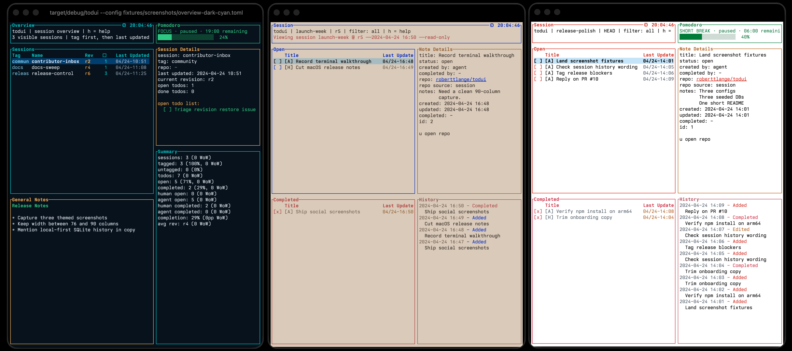

<p align="center">
  
</p>

<h1 align="center">todui</h1>

<p align="center">
  Local-first terminal todo sessions with a full-screen TUI, immutable revisions, and SQLite persistence.
</p>

<p align="center">
  
  
  
  
</p>

When work spans shell scripts, scratch markdown, and half-finished terminal notes, preserving a clean session history gets noisy fast. `todui` gives you one local place to capture todo sessions, browse immutable revisions, keep notes close to the work, and stay in the terminal from quick CLI automation to full-screen planning.

<p align="center">
  
</p>

## Quick Start

### Fastest: run with `npx`

```bash
npx -y @roberttlange/todui --help
```

### Install skills via `npx`

```bash
npx skills add RobertTLange/todui --skill '*' -a claude-code -a codex -y
```

### Install globally

```bash
npm install -g @roberttlange/todui
todui
```

The npm package downloads a prebuilt binary for macOS/Linux on `x64` and `arm64`; a local Rust toolchain is not required for the npm install path.

### From source

```bash
cargo install --path .
todui --help
```

## 60-Second Usage

```bash
todui session new "Writing Sprint" --tag work
todui add "Draft design spec" --session writing-sprint --note "cover CLI and TUI"
todui add "Review keybindings" --session writing-sprint --repo @exampleorg/todui-keymove
todui add "Interview notes" --session writing-sprint --human
todui resume writing-sprint
todui session history writing-sprint
todui export md writing-sprint --include-notes
```

CLI todo mutations default to agent provenance. Pass `--human` on `add` or `done` when the action should be recorded as human-authored.

## What You Get

- Session-based todo lists with one canonical session name per workspace.
- Full-screen TUI plus scriptable CLI for the same local SQLite data.
- Immutable revision history with read-only historical resume/export flows.
- Human vs agent provenance tracked for todo creation and completion.
- App-wide overview notes, todo notes, repo-aware metadata, and markdown export.
- Global Pomodoro timer surfaced in overview and live session views.

## Config

Default paths:

- config: `~/.config/todui/config.toml`
- database: `~/.local/share/todui/todui.db`

Overrides:

- config file: `[database].path = "/absolute/path/to/todui.db"`
- `TODO_TUI_CONFIG`
- `TODO_TUI_DB`
- CLI: `todui --config /absolute/path/to/config.toml ...`

Precedence for the config path:

- `--config`
- `TODO_TUI_CONFIG`
- default `~/.config/todui/config.toml`

Precedence for the database path after selecting the config file:

- `TODO_TUI_DB`
- `[database].path` in `config.toml`
- default `~/.local/share/todui/todui.db`

Seed a config file from the example:

```bash
mkdir -p ~/.config/todui
cp config.example.toml ~/.config/todui/config.toml
```

## Common TUI Keys

- `j` / `k`, arrows: move selection
- `n`: create a session or todo
- `e`: edit the selected session or todo
- `f`: cycle provenance filter (`all`, `human`, `agent`)
- `space` / `x`: toggle completion
- `H`: open session history
- `r`: return from a revision to the live head
- `m`: edit overview notes
- `q` / `Esc`: close overlay or quit

## Skills

- [Project Build skill](skills/project-build/SKILL.md)
- [Project Plan skill](skills/project-plan/SKILL.md)

## Verification

```bash
cargo fmt --check
cargo clippy --all-targets --all-features -- -D warnings
cargo test
TODOUI_SKIP_DOWNLOAD=1 npm ci
npm run build
npm test
```
